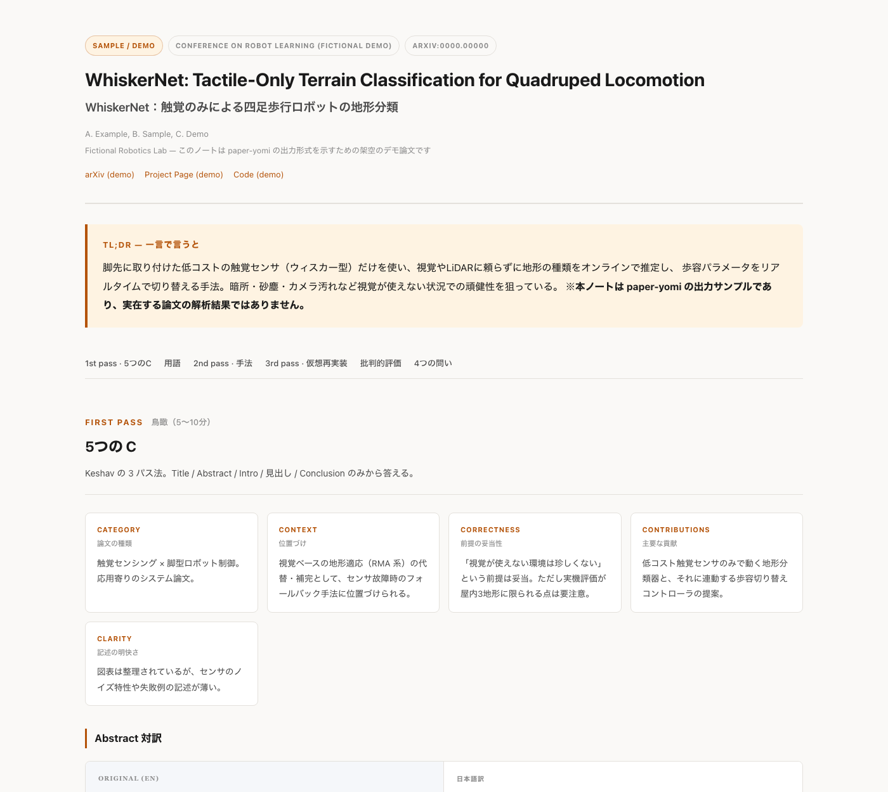
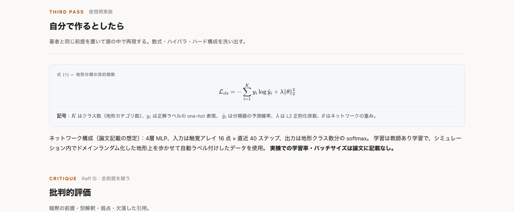

# paper-yomi

**英語論文を日本語で精読する [Claude Code](https://claude.com/claude-code) / [Claude](https://claude.ai) Skill。**
Keshav の「3 パス法」＋ Andrew Ng の「4 つの問い」＋ Jennifer Raff の精読法を統合し、
**英日対訳 2 カラムの自己完結型 HTML ノート**を 1 論文 = 1 ファイルで生成します。

対象は主にロボティクス／Physical AI／機械学習の論文。数式は LaTeX でそのまま扱い、
ビルド時にオフラインの SVG へ焼き込むので、ネットが無くても数式が崩れません。

---

## サンプル出力

> 下は `paper-yomi` が生成する HTML ノートのデモです（**架空の論文**を使ったフォーマット確認用サンプルで、実在の論文の解析結果ではありません）。

**冒頭 — タイトル・TL;DR・5 つの C・対訳ペア**



**数式ブロック（LaTeX → オフライン SVG）と批判的評価**



サンプル HTML の全文はこちら → [`docs/sample.html`](docs/sample.html)（ブラウザでプレビュー：[htmlpreview 経由で開く](https://htmlpreview.github.io/?https://github.com/yue-tsukiii/paper-yomi/blob/main/docs/sample.html)）

実際の出力ではこの構成に加えて、**用語対訳表・図の読み解き・仮想再実装（数式／ハイパラ／ハード構成）・
Sim-to-Real ギャップなど Physical AI 固有の批判チェックリスト・参考文献リンク集**が含まれます。

---

## 何をしてくれるのか

| 項目 | 内容 |
|---|---|
| 入力 | arXiv の URL / ID、ローカル PDF、論文タイトルのいずれか |
| 出力 | 英日対訳 2 カラムの HTML ノート（1 論文 = 1 ファイル、オフラインで完結） |
| 深さ | 既定で **3rd pass 相当**（数式の導出・ハイパラ・再現条件まで踏み込む） |
| 引用 | 英語原文は**重要箇所のみ**（Abstract 全文＋各節のキー文）。全文対訳はしない |
| 用語 | 専門用語は「英語＋日本語訳＋解説」を Glossary 表に。本文初出も `英語（日本語）` 表記 |
| 姿勢 | **褒めるだけのノートは失敗**。弱点・限界を最低 3 つ、具体的に指摘する |

### 統合しているメソッド

- **Keshav の 3 パス法** — 1st pass（鳥瞰・5 つの C）→ 2nd pass（手法の解剖）→ 3rd pass（仮想再実装）
- **Andrew Ng の 4 つの問い** — 何を達成しようとしたか／鍵となる要素／自分が使える部分／次に読むべき文献
- **Jennifer Raff の精読法** — 用語の棚卸し、実験の再構成、全前提を疑う批判的読解、Abstract との照合
- **Physical AI 固有チェックリスト** — Sim-to-Real ギャップ／評価の誠実さ／ハードウェア依存性／データ／再現可能性

---

## 使い方

Claude Code（または Skills に対応した Claude）で、このリポジトリを Skill としてインストールした状態で、
次のように話しかけるだけです。

```text
この論文を解析して：https://arxiv.org/abs/2503.xxxxx
```

```text
この PDF を日本語で精読ノートにして
（PDF ファイルを添付）
```

```text
"RMA: Rapid Motor Adaptation for Legged Robots" を精読ノートにして
```

トリガー例：「この論文を解析して」「論文を日本語でまとめて」「精読ノートを作って」

- 出力形式や深さを指定したい場合（Markdown で／1st pass だけでいい、等）は、そのまま伝えれば従います。指定がなければ既定値（上表）が使われます。
- 複数論文をまとめて依頼すると、論文ごとの HTML に加えて横断比較表付きの `index.html` も生成します。

### インストール

**Claude Code の場合**：このリポジトリをスキルディレクトリに `clone` するだけです。

```bash
git clone https://github.com/yue-tsukiii/paper-yomi.git ~/.claude/skills/paper-yomi
```

（スキルディレクトリの場所はセットアップにより異なります。プロジェクト単位のスキルとして使う場合は
プロジェクト内の `.claude/skills/` 配下に置いてください。）

### 数式レンダリングに必要なもの

数式は CDN の MathJax を使わず、**ビルド時に Node.js（`mathjax-full`）でオフライン SVG に変換**します。
初回のみ以下が必要です（詳細は [`SKILL.md`](SKILL.md) 参照）。

```bash
mkdir -p /tmp/mjx && cd /tmp/mjx && npm init -y
npm install mathjax-full@3.2.2
node scripts/render_math.mjs /path/to/output.html
```

---

## リポジトリ構成

```
paper-yomi/
├── SKILL.md                  # スキル本体（精読の手順・HTMLの書き方・品質チェック）
├── reference/
│   ├── method.md              # Keshav / Ng / Raff の統合メソッド全文
│   └── glossary.md            # ロボティクス用語 EN→JA 対訳辞書・訳出三原則
├── assets/
│   └── template.html          # 出力 HTML テンプレート
├── scripts/
│   └── render_math.mjs        # LaTeX → インライン SVG 変換スクリプト
└── docs/
    ├── sample.html             # サンプル出力（架空論文・フォーマット確認用）
    └── screenshots/            # README用スクリーンショット
```

---

## 品質へのこだわり

生成後、必ず以下を機械的にチェックしてから出力します（詳細は `SKILL.md` 参照）。

- [ ] 未置換プレースホルダ（`{{...}}`）が残っていないか
- [ ] 生の LaTeX（`$$`）が残っていないか＝数式レンダリング漏れの検知
- [ ] CDN 依存が残っていないか＝オフライン動作の保証
- [ ] HTML タグの閉じ忘れがないか
- [ ] 数値はすべて原文と照合したか、節・表番号を添えたか
- [ ] 弱点を 3 つ以上、具体的に挙げたか

---

## ライセンス

MIT
